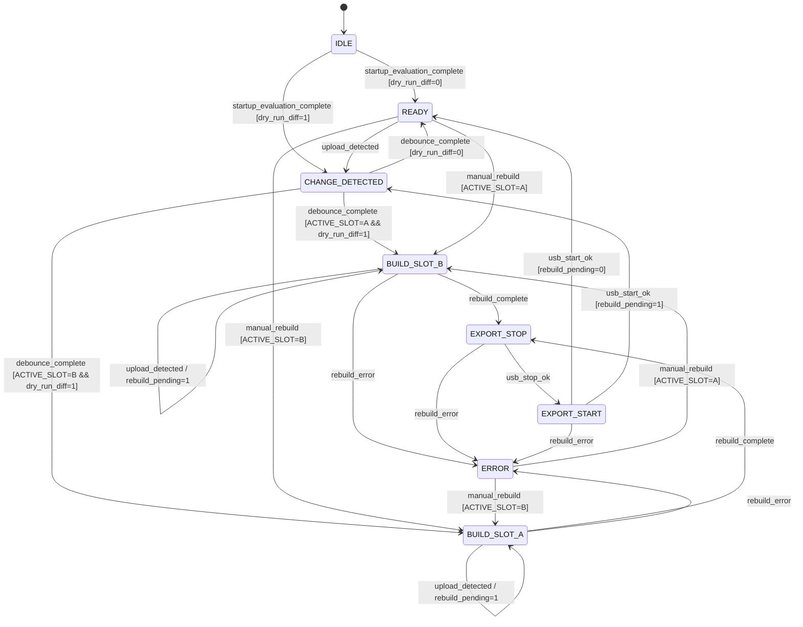

# Tryb SHADOW - specyfikacja implementacyjna A/B

## Cel i zakres

Dokument definiuje wymagania implementacyjne i eksploatacyjne trybu SHADOW A/B w systemie CNC Control.
Tryb SHADOW A/B rozdziela warstwę roboczą od warstwy eksportu USB i eliminuje modyfikację aktywnego obrazu.

Zakres dokumentu:
- architektura dual-slot,
- zarządzanie stanem FSM i stanem slotów,
- sekwencja rebuild i publikacji,
- zasady odporności na awarie,
- zasady diagnostyki i testów akceptacyjnych.

Poza zakresem:
- firmware RichAuto,
- logika PLC kontrolera.

## Architektura SHADOW A/B

Model danych:

```text
CNC_MASTER_DIR
CNC_USB_IMG_A
CNC_USB_IMG_B
CNC_ACTIVE_SLOT
```

Reguły architektoniczne:
- dokładnie jeden slot jest aktywny (`A` albo `B`),
- `g_mass_storage` wskazuje wyłącznie aktywny slot,
- slot nieaktywny pozostaje offline względem CNC i jest jedynym celem rebuild,
- rebuild jest wykonywany wyłącznie na slocie nieaktywnym,
- aktywny slot nie jest montowany w `rw`.

Mapowanie slotów:
- `CNC_ACTIVE_SLOT=A` oznacza aktywny `CNC_USB_IMG_A`,
- `CNC_ACTIVE_SLOT=B` oznacza aktywny `CNC_USB_IMG_B`.

## Persistencja stanu systemu

Źródło prawdy stanu FSM:
- plik stanu: `CNC_SHADOW_STATE_FILE`.

Format stanu:
- format: JSON,
- kodowanie: UTF-8,
- struktura jest stała w obrębie jednej wersji `CNC_SHADOW_CONFIG_VERSION`.

Minimalna struktura JSON:

```json
{
  "fsm_state": "IDLE|CHANGE_DETECTED|BUILD_SLOT_A|BUILD_SLOT_B|EXPORT_STOP|EXPORT_START|READY|ERROR",
  "active_slot": "A|B",
  "rebuild_slot": "A|B|null",
  "run_id": 0,
  "last_error": null,
  "rebuild_counter": 0
}
```

Pole `last_error`:
- przyjmuje dokładnie jedną z dwóch postaci: `null` albo obiekt:

```json
{
  "code": "string",
  "message": "string"
}
```

Relacja pól licznikowych:
- `run_id` jest głównym licznikiem przebiegu,
- `rebuild_counter` jest aliasem `run_id`,
- `run_id` i `rebuild_counter` przechowują identyczną wartość.

Wymagania zapisu:
- stan jest aktualizowany przy każdej zmianie stanu FSM,
- zapis stanu jest atomowy: `write tmp + fsync + rename`.

Wymagania odczytu:
- `status.sh`, WebUI i CLI odczytują stan wyłącznie z `CNC_SHADOW_STATE_FILE`,
- brak `CNC_SHADOW_STATE_FILE` wymusza inicjalizację FSM w `IDLE` i utworzenie pliku stanu.
- `rebuild_pending` nie jest utrwalane w `CNC_SHADOW_STATE_FILE`.

## Wersjonowanie konfiguracji SHADOW

Wymagania:
- obowiązuje zmienna `CNC_SHADOW_CONFIG_VERSION`,
- bieżąca wersja schematu: `1`,
- przy starcie usługi wykonywana jest walidacja zgodności wersji,
- zmiana wersji schematu wymusza migrację konfiguracji,
- brak zgodności wersji wymusza przejście do `ERROR`.

## Wymagane narzędzia systemowe

Wymagane pakiety:
- `dosfstools` (`mkfs.vfat`),
- `mtools` (`mcopy`),
- `util-linux` (`flock`),
- `kmod` (`modprobe`),
- `inotify-tools`.

Wymagania startowe:
- brak któregokolwiek wymaganego pakietu powoduje przejście do `ERROR` przy starcie usługi.

## Zarządzanie slotami

Wymagania:
- `CNC_ACTIVE_SLOT` przyjmuje wyłącznie `A` albo `B`,
- `CNC_ACTIVE_SLOT` jest używany wyłącznie przy pierwszym uruchomieniu, gdy `CNC_ACTIVE_SLOT_FILE` nie istnieje,
- po utworzeniu `CNC_ACTIVE_SLOT_FILE` jedynym źródłem prawdy aktywnego slotu jest `CNC_ACTIVE_SLOT_FILE`,
- po utworzeniu `CNC_ACTIVE_SLOT_FILE` niezgodność między `CNC_ACTIVE_SLOT` i `CNC_ACTIVE_SLOT_FILE` jest ignorowana,
- wybór slotu rebuild jest deterministyczny:
  - `ACTIVE=A` -> `REBUILD=B`,
  - `ACTIVE=B` -> `REBUILD=A`,
- po `usb_start_ok` aktualizacja aktywnego slotu jest atomowa,
- stan aktywnego slotu jest utrwalany w `CNC_ACTIVE_SLOT_FILE`.

Sekwencja aktualizacji aktywnego slotu:
1. odczytać `CNC_ACTIVE_SLOT_FILE`,
2. wyznaczyć `REBUILD_SLOT` jako slot przeciwny,
3. wykonać rebuild na `REBUILD_SLOT`,
4. wykonać `EXPORT_STOP` i `EXPORT_START` dla `REBUILD_SLOT`,
5. po `usb_start_ok` zapisać `CNC_ACTIVE_SLOT=REBUILD_SLOT` atomowo (`write tmp + fsync + rename`).

## Inicjalizacja przy starcie systemu

Wymagania cold start:
- kolejność operacji jest obowiązkowa i deterministyczna,
- przed oceną stanu slotów usuwane są wszystkie pliki tymczasowe slotów.

Algorytm cold start:
1. usunąć wszystkie pliki tymczasowe slotów (`*.tmp`),
2. sprawdzić istnienie `CNC_ACTIVE_SLOT_FILE`,
3. jeśli brak `CNC_ACTIVE_SLOT_FILE`:
   - utworzyć `CNC_USB_IMG_A` i `CNC_USB_IMG_B`,
   - wykonać full rebuild slotu `A`,
   - ustawić `ACTIVE_SLOT=A`,
   - przejść do `EXPORT_START`,
4. jeśli `CNC_ACTIVE_SLOT_FILE` istnieje:
   - zwalidować wskazany slot przez mount `ro`,
   - jeśli walidacja zakończy się sukcesem, użyć wskazanego slotu jako `ACTIVE_SLOT`,
   - jeśli walidacja zakończy się niepowodzeniem:
     - sprawdzić slot przeciwny przez mount `ro`,
     - jeśli slot przeciwny przejdzie walidację, wykonać fallback i zapisać `CNC_ACTIVE_SLOT_FILE` atomowo,
     - jeśli slot przeciwny nie przejdzie walidacji, przejść do `ERROR`,
5. wykonać porównanie dry-run:
   - `REBUILD_SLOT` jest slotem przeciwnym do `ACTIVE_SLOT`,
   - `rsync -a --delete --dry-run ${CNC_MASTER_DIR}/ -> ${REBUILD_SLOT_MOUNT}/`,
6. ustawić FSM zgodnie z wynikiem `dry_run_diff`:
   - `dry_run_diff=0` -> `READY`,
   - `dry_run_diff=1` -> `CHANGE_DETECTED`.

Kolejność powyższa jest obowiązkowa i deterministyczna.

## Definicja niespójności krytycznej

Niespójność krytyczna występuje wyłącznie, gdy zachodzi co najmniej jeden warunek:
- brak pliku obrazu slotu,
- niepoprawny system FAT obrazu slotu,
- niepoprawny mount testowy obrazu slotu,
- obecność nieusuniętego pliku tymczasowego obrazu.

## Algorytm detekcji rzeczywistej zmiany danych

Wymagania:
- zdarzenie inotify jest wyłącznie triggerem przejścia do `CHANGE_DETECTED`,
- po debounce wykonywane jest porównanie:
  - `rsync -a --delete --dry-run ${CNC_MASTER_DIR}/ -> ${REBUILD_SLOT_MOUNT}/`,
- rebuild startuje wyłącznie, gdy dry-run wykryje różnice,
- zakres różnic:
  - nowe pliki,
  - usunięte pliki,
  - zmiana rozmiaru,
  - zmiana `mtime`,
- brak różnic wymusza przejście do `READY`.

Reguły porównania:
- porównanie zawsze odbywa się względem slotu nieaktywnego,
- hashowanie katalogu nie jest mechanizmem podstawowym,
- wynik dry-run jest jedynym kryterium decyzji, czy rebuild jest wymagany,
- przy `CNC_SHADOW_INCREMENTAL=false` uruchomiony rebuild jest zawsze wykonywany jako full rebuild,
- przy `CNC_SHADOW_INCREMENTAL=false` system nie wykonuje rsync incremental i nie montuje slotu w `loop,rw`.

Formalna definicja "nowszego stanu `CNC_MASTER_DIR`":
- "nowszy stan" występuje wyłącznie, gdy wynik:
  - `rsync -a --delete --dry-run ${CNC_MASTER_DIR}/ -> ${REBUILD_SLOT_MOUNT}/`
  - wykazuje różnice, czyli `dry_run_diff=1`,
- timestamp katalogu `CNC_MASTER_DIR` nie jest kryterium decyzji.

## Model watchera inotify

Wymagania:
- watcher inotify działa w ramach tej samej usługi co FSM,
- watcher inotify nie działa jako oddzielna usługa systemd,
- restart usługi resetuje watcher inotify i FSM do stanu inicjalnego,
- brak watchera inotify przy starcie usługi powoduje przejście do `ERROR`.

## Weryfikacja przestrzeni dyskowej

Wymagania:
- kontrola przestrzeni jest wykonywana po uzyskaniu locka rebuild,
- kontrola przestrzeni dotyczy filesystemu, na którym znajdują się obrazy slotów,
- weryfikowana jest wartość dostępnej przestrzeni (`available_space`),
- jednostką porównania są bajty,
- `SLOT_SIZE_BYTES = CNC_SHADOW_SLOT_SIZE_MB * 1024 * 1024`,
- minimalna przestrzeń wymagana:
  - `available_space_bytes >= (2 * SLOT_SIZE_BYTES + 10% * SLOT_SIZE_BYTES)`,
- obliczenie nie uwzględnia plików tymczasowych, które jeszcze nie istnieją,
- niespełnienie progu przestrzeni wymusza `rebuild_error`,
- `rebuild_error` z braku przestrzeni blokuje przejście do `EXPORT_STOP`.

## Ograniczenia struktury katalogu master

Wymagania:
- obowiązuje limit liczby plików `CNC_SHADOW_MAX_FILES`,
- liczba plików jest liczona wyłącznie w `CNC_MASTER_DIR`,
- liczenie jest wykonywane przed rozpoczęciem rebuild,
- licznik obejmuje wyłącznie pliki regularne,
- przekroczenie limitu:
  - ustawia `last_error.code=ERR_TOO_MANY_FILES`,
  - blokuje rebuild,
  - nie wykonuje `EXPORT_STOP`,
  - przechodzi do `ERROR`,
- limit chroni Raspberry Pi Zero W przed degradacją wydajności podczas skanowania i synchronizacji.

## Ograniczenia trwałości nośnika

Wymagania:
- obowiązuje minimalny interwał między rebuild: `CNC_SHADOW_MIN_REBUILD_INTERVAL_SECONDS`,
- rebuild nie startuje częściej niż raz na zadany interwał,
- system utrzymuje licznik rebuild od startu systemu,
- `status.sh` raportuje licznik rebuild od startu.

## Atomowość przebudowy obrazu

Artefakty:
- aktywny slot: `ACTIVE_SLOT_PATH`,
- slot rebuild: `REBUILD_SLOT_PATH`,
- plik tymczasowy full rebuild: `${REBUILD_SLOT_PATH}${CNC_SHADOW_TMP_SUFFIX}`.

Sekwencja publikacji obrazu slotu nieaktywnego:
1. wejście do `BUILD_SLOT_A` albo `BUILD_SLOT_B`,
2. utworzenie obrazu tymczasowego,
3. `fsync` pliku tymczasowego,
4. `fsync` katalogu nadrzędnego,
5. atomowy `rename` do `REBUILD_SLOT_PATH`,
6. walidacja integralności `REBUILD_SLOT_PATH`,
7. `EXPORT_STOP`,
8. `EXPORT_START`,
9. atomowa aktualizacja `CNC_ACTIVE_SLOT_FILE` po `usb_start_ok`.

Zabronione operacje:
- modyfikacja aktywnego slotu podczas rebuild,
- montowanie aktywnego slotu w `rw`,
- publikacja pliku tymczasowego,
- pominięcie walidacji integralności przed `EXPORT_STOP`.

## Walidacja integralności obrazu

Wymagania:
- stały katalog walidacyjny: `/run/cnc-shadow-validate`,
- katalog `/run/cnc-shadow-validate` jest tworzony przy starcie usługi,
- przed `EXPORT_STOP` wykonywany jest testowy mount `REBUILD_SLOT_PATH` w `ro`,
- mount testowy jest wykonywany wyłącznie w `/run/cnc-shadow-validate`,
- sukces mount jest warunkiem przejścia do `EXPORT_STOP`,
- po walidacji wykonywany jest `umount`,
- katalog `/run/cnc-shadow-validate` nie jest usuwany dynamicznie,
- brak walidacji lub błąd walidacji blokuje publikację.

## Strategia podstawowa (wymagana) - full rebuild

Wymagania:
- implementacja Etapu 1 musi realizować full rebuild wyłącznie poniższą sekwencją,
- full rebuild zawsze używa `tmp + rename` z atomową publikacją,
- full rebuild jest obowiązkowy dla warunków:
  - zmiana `CNC_SHADOW_SLOT_SIZE_MB`,
  - brak slotu,
  - wykryta niespójność FAT,
  - ręczne wymuszenie przez API.

Sekwencja operacyjna full rebuild:
1. utworzyć obraz tymczasowy:
   - `truncate -s ${CNC_SHADOW_SLOT_SIZE_MB}M ${TMP_PATH}`
2. sformatować obraz:
   - `mkfs.vfat -F 32 ${TMP_PATH}`
3. skopiować dane master:
   - `mcopy -s -i ${TMP_PATH} ${CNC_MASTER_DIR}/ ::`
4. wykonać `fsync` pliku obrazu `${TMP_PATH}`,
5. wykonać `fsync` katalogu nadrzędnego obrazu,
6. wykonać atomowy rename:
   - `mv ${TMP_PATH} ${REBUILD_SLOT_PATH}`.

Zabronione w Etapie 1:
- mount loop `rw`,
- kopiowanie `cp -a` przez mount,
- `rsync` incremental,
- modyfikacja obrazu in-place.

## Obsługa pustego katalogu master

Wymagania:
- pusty `CNC_MASTER_DIR` jest stanem poprawnym,
- full rebuild tworzy poprawny, pusty system FAT,
- kopiowanie danych w full rebuild używa:
  - `mcopy -s -i ${TMP_PATH} ${CNC_MASTER_DIR}/ ::`,
- brak plików w `CNC_MASTER_DIR` nie powoduje `rebuild_error`.

## Strategia opcjonalna (tryb rozszerzony) - incremental rebuild

Incremental rebuild nie jest wymagany do poprawnego działania SHADOW A/B.

Wymagania wykonawcze:
- incremental rebuild działa wyłącznie na slocie nieaktywnym,
- slot nieaktywny jest montowany jako `loop,rw`,
- synchronizacja danych wykonuje:
  - `rsync -a --delete ${CNC_MASTER_DIR}/ -> ${SLOT_MOUNT}/`,
- po synchronizacji wykonywane są:
  - `umount`,
  - `fsync` obrazu.

Wymagania spójności:
- `--delete` jest obowiązkowe,
- brak `--delete` powoduje `rebuild_error`,
- aktywny slot nie jest modyfikowany.

Wymagania dla dużej liczby małych plików:
- czas rebuild obejmuje `mount + rsync + umount + fsync`,
- przekroczenie limitu czasu powoduje `rebuild_error`.

## Zmiana rozmiaru slotów

Wymagania:
- zmiana `CNC_SHADOW_SLOT_SIZE_MB` wymusza full rebuild obu slotów,
- zmiana rozmiaru nie modyfikuje aktywnego slotu in-place.

Sekwencja operacyjna:
1. utworzyć nowe obrazy `A` i `B` o nowym rozmiarze,
2. wykonać full rebuild na slocie nieaktywnym,
3. wykonać przełączenie USB na nowy slot,
4. wykonać full rebuild na drugim slocie.

## Synchronizacja i kontrola współbieżności

Wymagania:
- jednocześnie działa dokładnie jeden rebuild,
- lock globalny: `CNC_SHADOW_LOCK_FILE`,
- mechanizm lock: `flock`,
- WebUI odrzuca rebuild przy aktywnym locku,
- lock jest utrzymywany od wejścia do `BUILD_SLOT_*` do końca `EXPORT_START`.
- przy starcie usługi `rebuild_pending=0`,
- `rebuild_pending` jest wyłącznie flagą runtime.
- przy starcie usługi poprzednia wartość `rebuild_pending` jest ignorowana.

Kolejkowanie zmian:
- `upload_detected` podczas `BUILD_SLOT_*` ustawia `rebuild_pending=1`,
- `rebuild_pending=1` nie uruchamia równoległego rebuild,
- po `usb_start_ok`:
  - `rebuild_pending=0` -> `READY`,
  - `rebuild_pending=1` -> `CHANGE_DETECTED`.

Debounce:
- `CHANGE_DETECTED` utrzymuje okno debounce,
- czas debounce: `CNC_SHADOW_DEBOUNCE_SECONDS` w zakresie `3..5` sekund,
- rebuild startuje wyłącznie po `debounce_complete`.

## Mechanika EXPORT_STOP / EXPORT_START

Metoda wykonania jest jednolita i obowiązkowa:
- wyłącznie `modprobe`,
- bez użycia `configfs`.

Sekwencja `EXPORT_STOP`:
1. wykonać:
   - `modprobe -r g_mass_storage`
2. potwierdzić zdarzenie `usb_stop_ok` w limicie czasu.

Sekwencja `EXPORT_START`:
1. wykonać:
   - `modprobe g_mass_storage file=${ACTIVE_SLOT_PATH} ro=1`
2. potwierdzić zdarzenie `usb_start_ok` w limicie czasu.

Wymagania:
- brak retry automatycznego,
- brak alternatywnej metody przełączania USB,
- brak mieszania metod `modprobe` i `configfs` w jednym przebiegu,
- `CNC_ACTIVE_SLOT_FILE` jest aktualizowany wyłącznie po `usb_start_ok`,
- błąd `EXPORT_START` powoduje:
  - brak aktualizacji `CNC_ACTIVE_SLOT_FILE`,
  - przejście do `ERROR`,
  - zachowanie poprzedniego slotu jako logicznie aktywnego,
- system nie wykonuje automatycznego rollback,
- brak potwierdzenia `usb_stop_ok` albo `usb_start_ok` skutkuje deterministycznym przejściem do `ERROR`.

## Definicja potwierdzeń operacji USB

`usb_stop_ok` występuje wyłącznie, gdy jednocześnie spełnione są warunki:
- polecenie `modprobe -r g_mass_storage` zakończyło się kodem `0`,
- moduł `g_mass_storage` nie jest obecny w `lsmod`.

`usb_start_ok` występuje wyłącznie, gdy jednocześnie spełnione są warunki:
- polecenie `modprobe g_mass_storage file=${ACTIVE_SLOT_PATH} ro=1` zakończyło się kodem `0`,
- moduł `g_mass_storage` jest obecny w `lsmod`.

Reguły potwierdzeń:
- użycie alternatywnych heurystyk jest zabronione,
- potwierdzenie wyłącznie na podstawie czasu jest zabronione,
- mieszanie `modprobe` i `configfs` jest zabronione,
- potwierdzenia są deterministyczne.

## Formalna definicja `rebuild_complete`

`rebuild_complete` występuje wyłącznie, gdy jednocześnie spełnione są warunki:
- zakończono tworzenie obrazu,
- wykonano `fsync` pliku obrazu,
- wykonano `fsync` katalogu nadrzędnego,
- wykonano atomowy `rename` do `REBUILD_SLOT_PATH`,
- walidacja integralności przez mount `ro` zakończyła się sukcesem.

Reguła przejścia FSM:
- przejście z `BUILD_SLOT_*` do `EXPORT_STOP` następuje wyłącznie po `rebuild_complete`.

## Timeouty operacji USB

Wymagane parametry:
- `CNC_SHADOW_USB_STOP_TIMEOUT` (sekundy),
- `CNC_SHADOW_USB_START_TIMEOUT` (sekundy).

Wymagania:
- brak `usb_stop_ok` w `CNC_SHADOW_USB_STOP_TIMEOUT` powoduje `rebuild_error`,
- brak `usb_start_ok` w `CNC_SHADOW_USB_START_TIMEOUT` powoduje `rebuild_error`,
- automatyczny retry jest zabroniony,
- przejście do `ERROR` jest deterministyczne.

Mapowanie timeoutów i skutków:
- przekroczenie `CNC_SHADOW_USB_STOP_TIMEOUT`:
  - ustawia `last_error.code=ERR_USB_STOP_TIMEOUT`,
  - ustawia `last_error.message`,
  - przełącza FSM do `ERROR`,
  - zwalnia lock rebuild,
  - nie aktualizuje `CNC_ACTIVE_SLOT_FILE`,
  - nie wykonuje retry,
- przekroczenie `CNC_SHADOW_USB_START_TIMEOUT`:
  - ustawia `last_error.code=ERR_USB_START_TIMEOUT`,
  - ustawia `last_error.message`,
  - przełącza FSM do `ERROR`,
  - zwalnia lock rebuild,
  - nie aktualizuje `CNC_ACTIVE_SLOT_FILE`,
  - nie wykonuje retry,
- przekroczenie `CNC_SHADOW_MAX_REBUILD_TIME`:
  - ustawia `last_error.code=ERR_REBUILD_TIMEOUT`,
  - ustawia `last_error.message`,
  - przełącza FSM do `ERROR`,
  - zwalnia lock rebuild,
  - nie aktualizuje `CNC_ACTIVE_SLOT_FILE`,
  - nie wykonuje retry.

## Tryb maintenance

Wymagania:
- obowiązuje zmienna `CNC_SHADOW_MAINTENANCE_MODE=true|false`,
- `CNC_SHADOW_MAINTENANCE_MODE=true` wymusza:
  - blokadę rozpoczęcia nowego `BUILD_SLOT_*`,
  - dostęp do ręcznej diagnostyki slotów,
- `CNC_SHADOW_MAINTENANCE_MODE=true` nie przerywa trwającego `EXPORT_STOP` ani `EXPORT_START`,
- wyjście z maintenance wymaga restartu usługi.

## Maszyna stanów (FSM)



Opis stanów:
- `IDLE`: stan przejściowy występujący wyłącznie przy starcie usługi,
- `CHANGE_DETECTED`: debounce i detekcja rzeczywistej zmiany,
- `BUILD_SLOT_A`: rebuild slotu A przy aktywnym B,
- `BUILD_SLOT_B`: rebuild slotu B przy aktywnym A,
- `EXPORT_STOP`: zatrzymanie eksportu aktywnego slotu,
- `EXPORT_START`: publikacja slotu rebuild,
- `READY`: stabilny eksport,
- `ERROR`: blokada automatu do czasu wywołania `manual_rebuild`.

Semantyka stanu `IDLE`:
- `IDLE` występuje wyłącznie podczas startu usługi,
- po osiągnięciu `READY` FSM nie wraca do `IDLE` w runtime,
- `IDLE` przechodzi deterministycznie do `READY` albo `CHANGE_DETECTED` zgodnie z warunkiem `dry_run_diff`.

Formalna definicja stanu `READY`:
- USB jest aktywne,
- `CNC_ACTIVE_SLOT_FILE` wskazuje aktualnie eksportowany slot,
- brak aktywnego locka rebuild,
- `rebuild_pending=0`,
- brak przekroczonych timeoutów,
- brak nieusuniętych plików tymczasowych,
- stan `READY` jest stabilny i nie zawiera operacji asynchronicznych.

Reguła wykonania dla `BUILD_SLOT_*`:
- `CNC_SHADOW_INCREMENTAL=false` -> full rebuild,
- `CNC_SHADOW_INCREMENTAL=true` -> incremental rebuild.

## Priorytet zdarzeń FSM

Kolejność priorytetów:
1. `ERROR`
2. `MAINTENANCE_MODE`
3. `manual_rebuild`
4. `upload_detected`

Reguły priorytetów:
- `manual_rebuild` przerywa debounce i przechodzi bezpośrednio do `BUILD_SLOT_*`,
- `maintenance_mode=true` blokuje rozpoczęcie nowego `BUILD_SLOT_*` i nie przerywa trwającego `EXPORT_*`,
- `upload_detected` w trakcie `BUILD_SLOT_*` ustawia `rebuild_pending=1`.

## Zachowanie w stanie ERROR

Wymagania:
- automatyczne przełączanie slotów w `ERROR` jest zabronione,
- automatyczny retry w `ERROR` jest zabroniony,
- wyjście z `ERROR` wymaga `manual_rebuild`,
- `status.sh` raportuje ostatni `RUN_ID` i kod błędu,
- WebUI wyświetla stan `ERROR` jednoznacznie.
- przejście do `ERROR` zeruje `rebuild_pending`,
- zdarzenie `upload_detected` w stanie `ERROR` może ustawić `rebuild_pending=1`,
- `rebuild_pending` w stanie `ERROR` nie powoduje automatycznego przejścia FSM,
- `rebuild_pending` w stanie `ERROR` jest brane pod uwagę dopiero po wywołaniu `manual_rebuild`,
- `manual_rebuild` rozpoczyna nowy przebieg niezależnie od wartości `rebuild_pending`,
- "W stanie ERROR flaga rebuild_pending nie wpływa na FSM do czasu wywołania manual_rebuild."

## Zachowanie flag przy przejściu do ERROR

Wymagania:
- przejście do `ERROR` zeruje `rebuild_pending`,
- lock rebuild jest zwalniany przy wejściu do `ERROR`,
- `CNC_ACTIVE_SLOT_FILE` nie jest modyfikowany przy wejściu do `ERROR`,
- `RUN_ID` pozostaje wartością ostatniego przebiegu,
- `manual_rebuild` czyści `last_error` przed rozpoczęciem nowego przebiegu,
- `manual_rebuild` uruchamia przebieg rebuild niezależnie od wartości `rebuild_pending`,
- automatyczny reset `ERROR` jest zabroniony.

## Specyfikacja strategii rebuild

`CNC_SHADOW_REBUILD_STRATEGY` przyjmuje wartości: `auto`, `manual`, `auto_debounce`.

Implementacja trybu SHADOW A/B wymaga obsługi full rebuild.
Implementacja incremental rebuild jest opcjonalna.

| Strategia | Warunek startu | Inicjator | Interakcja użytkownika |
|---|---|---|---|
| `auto` | `upload_detected` i `dry_run_diff=1` | watcher | brak |
| `manual` | `manual_rebuild` | API/WebUI/CLI | wymagana |
| `auto_debounce` | `upload_detected` + `debounce_complete` + `dry_run_diff=1` | watcher + timer | brak |

Reguły wspólne:
- każda strategia wymaga locka,
- każda strategia wybiera slot rebuild na podstawie `ACTIVE_SLOT`,
- każda strategia aktualizuje `CNC_ACTIVE_SLOT_FILE` po `usb_start_ok`,
- przy `CNC_SHADOW_INCREMENTAL=false` wszystkie uruchomione rebuildy są wykonywane jako full rebuild; wynik dry-run wpływa wyłącznie na decyzję uruchomienia rebuild.
- domyślna konfiguracja `CNC_SHADOW_REBUILD_STRATEGY=auto_debounce` działa w trybie FULL, gdy `CNC_SHADOW_INCREMENTAL=false`.

## Etapowanie implementacji

Etap 1 (wymagany):
- SHADOW A/B,
- `CNC_SHADOW_INCREMENTAL` musi być `false`,
- wyłącznie full rebuild,
- brak obsługi mount loop `rw`,
- brak rsync incremental.
- kod incremental nie jest wymagany.

Etap 2 (opcjonalny):
- aktywacja `CNC_SHADOW_INCREMENTAL=true`,
- włączenie strategii incremental rebuild,
- dodatkowa walidacja czasu rebuild dla trybu rozszerzonego.

## Interfejs wywołań rebuild

Wymagania:
- `manual_rebuild` jest wywoływany przez:
  - CLI,
  - `systemd-run`,
  - dedykowany endpoint WebUI,
- rebuild bez locka jest zabroniony,
- status FSM jest publikowany przez jedno źródło prawdy: `CNC_SHADOW_STATE_FILE`.

## Odporność na zanik zasilania

Wymagania:
- zanik zasilania podczas `BUILD_SLOT_*` nie modyfikuje aktywnego slotu,
- przy starcie wykonywana jest walidacja slotu wskazanego przez `CNC_ACTIVE_SLOT_FILE`,
- fallback do slotu przeciwnego jest wykonywany wyłącznie, gdy:
  - slot przeciwny istnieje,
  - slot przeciwny przechodzi walidację integralności (mount `ro`),
- fallback jest zapisywany atomowo do `CNC_ACTIVE_SLOT_FILE`,
- jeśli slot przeciwny nie przejdzie walidacji integralności, FSM przechodzi do `ERROR`,
- jeśli slot przeciwny nie przejdzie walidacji integralności, system nie wykonuje automatycznego rebuild bez `manual_rebuild`.

Kontrole startowe:
- brak obrazu slotu,
- niepoprawny FAT,
- niespójność stanu slotu,
- obecność plików tymczasowych `${CNC_USB_IMG_A}${CNC_SHADOW_TMP_SUFFIX}` lub `${CNC_USB_IMG_B}${CNC_SHADOW_TMP_SUFFIX}`.

Reakcje startowe:
- pliki tymczasowe są usuwane,
- brak spójności krytycznej wymusza full rebuild obu slotów.

## Migracja z trybu NET/USB do SHADOW A/B

Kroki migracji:
1. utworzyć `CNC_MASTER_DIR`,
2. utworzyć `CNC_USB_IMG_A` i `CNC_USB_IMG_B`,
3. skopiować dane źródłowe do obu slotów,
4. utworzyć `CNC_ACTIVE_SLOT_FILE` z wartością `A`,
5. aktywować SHADOW A/B,
6. zweryfikować spójność i gotowość FSM.

## Migracja z SHADOW single-slot do SHADOW A/B

Kroki:
1. utworzyć drugi obraz,
2. skopiować dane z istniejącego obrazu do obu slotów,
3. ustawić `CNC_ACTIVE_SLOT=A`,
4. zweryfikować spójność,
5. aktywować tryb A/B.

Rollback z A/B do single-slot:
1. wyłączyć SHADOW A/B,
2. wybrać slot źródłowy rollback,
3. skopiować slot do obrazu single-slot,
4. przywrócić konfigurację single-slot,
5. zweryfikować poprawność eksportu.

## Strategia implementacji – tryb docelowy

- SHADOW zastępuje historyczny tryb przełączania NET/USB jako tryb obowiązujący.
- Tryb NET/USB pozostaje warstwą legacy i jest stopniowo wycofywany.
- Dla nowych wdrożeń obowiązuje konfiguracja `CNC_SHADOW_ENABLED=true`.
- Konfiguracja `CNC_SHADOW_ENABLED=false` jest dopuszczalna wyłącznie dla kompatybilności i migracji.

## Parametry konfiguracyjne

| Zmienna | Typ | Zakres / wartości | Wartość domyślna | Wymaga restartu |
|---|---|---|---|---|
| `CNC_SHADOW_ENABLED` | bool | `true` / `false` | `false` | tak |
| `CNC_SHADOW_CONFIG_VERSION` | int | `1` | `1` | tak |
| `CNC_MASTER_DIR` | path | katalog istniejący `rw` | `/var/lib/cnc-control/master` | tak |
| `CNC_USB_IMG_A` | path | plik obrazu FAT slotu A | `/var/lib/cnc-control/cnc_usb_a.img` | tak |
| `CNC_USB_IMG_B` | path | plik obrazu FAT slotu B | `/var/lib/cnc-control/cnc_usb_b.img` | tak |
| `CNC_ACTIVE_SLOT` | enum | `A` / `B` | `A` | tak |
| `CNC_ACTIVE_SLOT_FILE` | path | plik stanu aktywnego slotu | `/var/lib/cnc-control/shadow_active_slot.state` | tak |
| `CNC_SHADOW_STATE_FILE` | path | plik stanu FSM | `/var/lib/cnc-control/shadow_state.json` | tak |
| `CNC_SHADOW_SLOT_SIZE_MB` | int | `128..2048` | `256` | tak |
| `CNC_USB_LABEL` | string | etykieta FAT, max 11 znaków | `CNC_USB` | tak |
| `CNC_SHADOW_INCREMENTAL` | bool | `true` / `false` | `false` | tak |
| `CNC_SHADOW_REBUILD_STRATEGY` | enum | `auto`, `manual`, `auto_debounce` | `auto_debounce` (FULL) | tak |
| `CNC_SHADOW_LOCK_FILE` | path | plik lock | `/var/run/cnc-shadow.lock` | tak |
| `CNC_SHADOW_DEBOUNCE_SECONDS` | int | `3..5` | `4` | nie |
| `CNC_SHADOW_TMP_SUFFIX` | string | `.tmp` | `.tmp` | tak |
| `CNC_SHADOW_MAX_REBUILD_TIME` | int (seconds) | `30..900` | `300` | nie |
| `CNC_SHADOW_USB_STOP_TIMEOUT` | int (seconds) | `1..120` | `10` | nie |
| `CNC_SHADOW_USB_START_TIMEOUT` | int (seconds) | `1..120` | `10` | nie |
| `CNC_SHADOW_MAINTENANCE_MODE` | bool | `true` / `false` | `false` | tak |
| `CNC_SHADOW_MAX_FILES` | int | `1..200000` | `20000` | tak |
| `CNC_SHADOW_MIN_REBUILD_INTERVAL_SECONDS` | int (seconds) | `1..3600` | `15` | nie |

Reguły konfiguracyjne:
- `CNC_ACTIVE_SLOT` jest używany wyłącznie przy pierwszym uruchomieniu,
- po utworzeniu `CNC_ACTIVE_SLOT_FILE` jedynym źródłem prawdy aktywnego slotu jest `CNC_ACTIVE_SLOT_FILE`,
- liczba slotów runtime wynosi dokładnie dwa,
- brak zgodności `CNC_SHADOW_CONFIG_VERSION` wymusza `ERROR`,
- jeśli `CNC_SHADOW_INCREMENTAL=false`, wszystkie uruchomione rebuildy są wykonywane jako FULL,
- jeśli `CNC_SHADOW_INCREMENTAL=false`, wynik dry-run nie wpływa na wybór typu rebuild,
- `CNC_SHADOW_SLOT_SIZE_MB=256` jest wartością referencyjną dla Raspberry Pi Zero W,
- `CNC_SHADOW_SLOT_SIZE_MB=1024` jest wartością dopuszczalną, ale nie jest wartością domyślną.

## Zmiana konfiguracji bez restartu

Wymagania:
- parametry oznaczone jako `Wymaga restartu` są odczytywane wyłącznie przy starcie usługi,
- zmiana parametrów oznaczonych jako `Wymaga restartu` bez restartu nie wpływa na działający system,
- zmiana pliku konfiguracyjnego w trakcie pracy nie powoduje przejścia do `ERROR`,
- nowe wartości parametrów oznaczonych jako `Wymaga restartu` obowiązują wyłącznie po restarcie usługi.

## Identyfikator przebiegu rebuild

Wymagania:
- każdy rebuild posiada `RUN_ID`,
- `RUN_ID` jest 64-bitową liczbą całkowitą bez znaku (`uint64`),
- zakres `RUN_ID` wynosi `0..18446744073709551615`,
- `RUN_ID` jest przechowywany w `CNC_SHADOW_STATE_FILE`,
- `RUN_ID` jest inkrementowany dokładnie o `1` przy wejściu do `BUILD_SLOT_A` albo `BUILD_SLOT_B`,
- overflow `RUN_ID` jest zabroniony,
- osiągnięcie `RUN_ID=18446744073709551615` i próba inkrementacji wymusza przejście do `ERROR` z kodem `ERR_RUN_ID_OVERFLOW`,
- `RUN_ID` nie jest resetowany przy restarcie usługi,
- `RUN_ID` jest zapisywany w logach i w `CNC_SHADOW_STATE_FILE`,
- `rebuild_counter` jest aliasem `RUN_ID`,
- `RUN_ID` i `rebuild_counter` są zawsze równe.

## Kody błędów systemu SHADOW

Dozwolony katalog kodów błędów:
- `ERR_NO_SPACE`,
- `ERR_USB_STOP_TIMEOUT`,
- `ERR_USB_START_TIMEOUT`,
- `ERR_FAT_INVALID`,
- `ERR_REBUILD_TIMEOUT`,
- `ERR_TOO_MANY_FILES`,
- `ERR_RUN_ID_OVERFLOW`,
- `ERR_CONFIG_VERSION`,
- `ERR_MISSING_DEPENDENCY`,
- `ERR_LOCK_CONFLICT`.

Reguła katalogu:
- użycie kodu spoza powyższej listy jest niedozwolone,
- rozszerzenie listy kodów błędów wymaga nowej wersji specyfikacji.

## Definicja czasu rebuild

Wymagania:
- czas rebuild jest liczony od wejścia do `BUILD_SLOT_A` albo `BUILD_SLOT_B`,
- czas rebuild kończy się przy `usb_start_ok` w `EXPORT_START`,
- czas rebuild obejmuje:
  - tworzenie obrazu,
  - walidację integralności,
  - `EXPORT_STOP`,
  - `EXPORT_START`.

## Diagnostyka i obserwowalność

Wymagany zakres `status.sh`:
- `RUN_ID` ostatniego przebiegu,
- `ACTIVE_SLOT`,
- `REBUILD_SLOT`,
- aktualny stan FSM,
- czas ostatniego rebuild,
- czas trwania ostatniego rebuild,
- typ ostatniego rebuild (`incremental` albo `full`),
- licznik rebuild od startu,
- ostatni błąd (`code`, `message`).

Wymagane logowanie:
- start rebuild,
- zakończenie rebuild,
- błąd rebuild,
- `EXPORT_STOP`,
- `EXPORT_START`,
- aktualizacja `ACTIVE_SLOT`.

Każdy wpis logu zawiera:
- timestamp,
- `RUN_ID`,
- `ACTIVE_SLOT` przed przełączeniem,
- `REBUILD_SLOT`,
- stan FSM,
- wynik (`ok` / `error`).

## Wymagania dotyczące logowania

Wymagania:
- dozwolone poziomy logowania: `INFO`, `ERROR`,
- logowanie `DEBUG` w produkcji jest zabronione,
- maksymalny rozmiar pojedynczego pliku logu: `5 MB`,
- rotacja logów: minimum `3` pliki,
- mechanizm logowania nie może blokować FSM.

## Wymagania niefunkcjonalne - dual-slot

Twarde limity czasowe (Raspberry Pi Zero W):

Limity obowiązkowe (pierwsza wersja, strategia podstawowa FULL):

| Operacja | Limit maksymalny |
|---|---|
| full rebuild dla `256 MB` danych wejściowych | `120 s` |
| full rebuild dla `512 MB` danych wejściowych | `240 s` |
| `EXPORT_STOP + EXPORT_START` | `20 s` |

Limity trybu rozszerzonego (dotyczy wyłącznie incremental rebuild):

| Operacja | Limit maksymalny |
|---|---|
| incremental rebuild dla `50 MB` zmian | `60 s` |
| incremental rebuild dla `200 MB` zmian | `180 s` |

Dodatkowe limity:
- przekroczenie `CNC_SHADOW_MAX_REBUILD_TIME` powoduje `rebuild_error`,
- przekroczenie timeoutów USB powoduje `rebuild_error`,
- limity incremental rebuild obowiązują tylko gdy `CNC_SHADOW_INCREMENTAL=true`.

Skutek przekroczenia limitu czasu:
- ustawienie `last_error` z odpowiednim kodem,
- przejście FSM do `ERROR`,
- zwolnienie locka rebuild,
- brak aktualizacji `CNC_ACTIVE_SLOT_FILE`,
- brak retry.

Wymagania pojemnościowe:
- wolna przestrzeń nie mniejsza niż `2 * SLOT_SIZE_BYTES + 10% * SLOT_SIZE_BYTES`,
- przestrzeń poniżej progu blokuje rebuild.

## Minimalny zakres testów akceptacyjnych

| Scenariusz | Oczekiwany stan FSM | Oczekiwany ACTIVE_SLOT | Oczekiwany rezultat |
|---|---|---|---|
| 1. upload pojedynczego pliku | `READY` po sekwencji `CHANGE_DETECTED -> BUILD_SLOT_* -> EXPORT_*` | przełączony na slot rebuild | nowy plik widoczny na CNC |
| 2. upload wielu plików | `READY` | przełączony na slot rebuild | pełna synchronizacja plików i usunięć |
| 3. upload w trakcie rebuild | `READY` po dodatkowej pętli przez `CHANGE_DETECTED` | przełączony po drugim przebiegu | `rebuild_pending=1` obsłużony bez równoległych buildów |
| 4. zanik zasilania podczas BUILD | po restarcie przejście przez `IDLE` do `READY` albo `CHANGE_DETECTED`, następnie `READY` | aktywny slot sprzed awarii | brak uszkodzenia aktywnego slotu |
| 5. zanik zasilania podczas EXPORT_STOP | po restarcie `ERROR` albo przejście przez `IDLE` do `READY` albo `CHANGE_DETECTED`, finalnie `READY` po `manual_rebuild` | ostatni poprawny slot | brak niekontrolowanego przełączenia |
| 6. brak miejsca na SD | `ERROR` | bez zmian | `rebuild_error` z kodem braku przestrzeni |
| 7. zmiana SLOT_SIZE | `READY` po dwóch full rebuildach i jednym przełączeniu | zgodny z sekwencją zmiany rozmiaru | oba sloty w nowym rozmiarze |
| 8. manual_rebuild | `READY` | przełączony na slot rebuild | rebuild uruchomiony z CLI/systemd-run/WebUI |
| 9. rollback | `READY` w modelu docelowym rollback | zgodny z wybranym źródłem rollback | dane i eksport zgodne po rollback |
| 10. cold start bez ACTIVE_SLOT_FILE | `READY` po inicjalizacji od `IDLE` | `A` | utworzone oba sloty i pełna inicjalizacja stanu |
