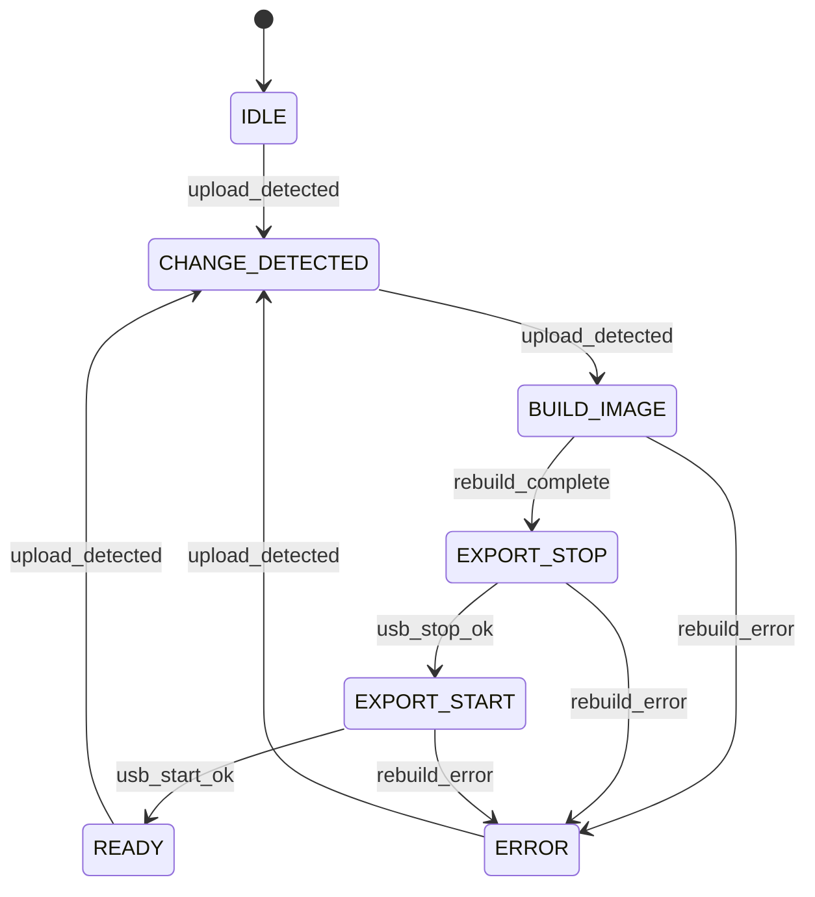

# Tryb SHADOW - dokumentacja architektoniczna

## Cel i zakres

Tryb SHADOW definiuje docelowy model pracy bez ręcznego przełączania `NET/USB`.
System zapisuje pliki wejściowe do katalogu roboczego (`master`), a kontroler CNC
otrzymuje wyłącznie obraz eksportowy FAT podłączany przez `g_mass_storage` w trybie `ro=1`.

Zakres dokumentu:
- architektura logiczna i przepływ stanu,
- zależności od aktualnego repozytorium,
- plan migracji z modelu `NET/USB`,
- parametry konfiguracyjne,
- wymagania niefunkcjonalne.

Poza zakresem:
- modyfikacja firmware RichAuto,
- modyfikacja logiki PLC.

## Zgodność z aktualnym repozytorium

| Komponent | Stan w repo | Rola w SHADOW |
|---|---|---|
| `usb_mode.sh` | aktywny, ładuje `g_mass_storage file=${CNC_USB_IMG} ro=1` | punkt eksportu obrazu `export.img` |
| `net_mode.sh` | aktywny, montuje `${CNC_USB_IMG}` w `rw` przez loop | tryb legacy do wygaszenia po migracji |
| `webui/app.py` | upload do `CNC_UPLOAD_DIR`, przełączanie trybów | upload do `CNC_MASTER_DIR`, sterowanie przebudową |
| `config/cnc-control.env.example` | zawiera `CNC_USB_IMG`, `CNC_USB_IMG_SIZE_MB`, `CNC_MOUNT_POINT`, `CNC_UPLOAD_DIR` | źródło konfiguracji bazowej i migracyjnej |
| `status.sh` | diagnostyka montowania i stanu gadget | diagnostyka stanu FSM i ostatniego rebuild |

## Architektura logiczna SHADOW

Model docelowy:

```text
CNC_MASTER_DIR (RW dla Linux/WebUI/Samba)
    -> proces rebuild
        -> CNC_USB_IMG (FAT, artefakt eksportowy)
            -> g_mass_storage (RO dla CNC)
```

Zasady:
- Brak równoczesnego użycia tego samego obrazu FAT w `rw` i przez USB gadget.
- Każda zmiana danych w `CNC_MASTER_DIR` inicjuje sekwencję rebuild (automatycznie lub ręcznie).
- Obraz eksportowy jest jedynym źródłem danych widzianym przez kontroler CNC.

## Przepływ operacyjny

1. Upload pliku do `CNC_MASTER_DIR` (WebUI/Samba).
2. Detekcja zmiany (`upload_detected`).
3. Rebuild obrazu FAT na podstawie stanu `master`.
4. Bezpieczne przełączenie USB gadget na nowy obraz.
5. Potwierdzenie gotowości (`READY`) lub wejście w `ERROR`.

## Maszyna stanów (FSM)



### Opis stanów oraz warunków wejścia/wyjścia

| Stan | Warunek wejścia | Warunek wyjścia | Efekt techniczny |
|---|---|---|---|
| `IDLE` | Start usługi SHADOW, brak nierozliczonych zmian | `upload_detected` | Brak aktywnego rebuild, utrzymanie bieżącego eksportu |
| `CHANGE_DETECTED` | Otrzymano `upload_detected` z watchera/API | Ponowne `upload_detected` po zakończeniu debouncingu i kolejkowania | Konsolidacja wielu zmian do jednego rebuild |
| `BUILD_IMAGE` | Zlecono rebuild nowego obrazu | `rebuild_complete` lub `rebuild_error` | Tworzenie i wypełnienie obrazu FAT z `CNC_MASTER_DIR` |
| `EXPORT_STOP` | `rebuild_complete` | `usb_stop_ok` lub `rebuild_error` | Odłączenie `g_mass_storage` od poprzedniego obrazu |
| `EXPORT_START` | `usb_stop_ok` | `usb_start_ok` lub `rebuild_error` | Podłączenie `g_mass_storage` do nowego obrazu |
| `READY` | `usb_start_ok` | `upload_detected` | Stabilna ekspozycja aktualnego obrazu dla CNC |
| `ERROR` | Błąd rebuild lub błąd przełączenia USB (`rebuild_error`) | `upload_detected` (retry po nowej zmianie) | Zatrzymanie automatu i oczekiwanie na poprawny kolejny przebieg |

## Migracja z trybu NET/USB do SHADOW

### A. Stan obecny

Aktualny model:
- `net_mode.sh`: odłącza `g_mass_storage`, montuje `CNC_USB_IMG` lokalnie (`rw`) w `CNC_MOUNT_POINT`.
- `usb_mode.sh`: odmontowuje lokalny mount, ładuje `g_mass_storage` z `CNC_USB_IMG` (`ro=1`).
- WebUI zapisuje pliki do `CNC_UPLOAD_DIR` (zwykle to samo co `CNC_MOUNT_POINT`).

Kluczowa zależność:
- pojedynczy plik `cnc_usb.img` (`CNC_USB_IMG`) pełni jednocześnie rolę katalogu roboczego i nośnika eksportowego, co wymaga ręcznego przełączania trybów.

### B. Kroki migracji

1. Utworzenie katalogu master.
   - Utworzyć `CNC_MASTER_DIR` (np. `/var/lib/cnc-control/master`), nadać właściciela i prawa zapisu dla procesu WebUI/Samba.
2. Zmiana zmiennych środowiskowych.
   - Dodać `CNC_SHADOW_ENABLED`, `CNC_SHADOW_IMG_SIZE_MB`, `CNC_MASTER_DIR`, `CNC_SHADOW_REBUILD_STRATEGY`.
   - Ustawić `CNC_UPLOAD_DIR=${CNC_MASTER_DIR}`.
   - Zachować `CNC_USB_IMG` jako ścieżkę obrazu eksportowego.
3. Modyfikacja `usb_mode.sh`.
   - Zostawić odpowiedzialność za `EXPORT_STOP/EXPORT_START`.
   - Usunąć założenie, że obraz jest wcześniej montowany w `rw`.
   - Dodać obsługę przełączenia na nowo wygenerowany artefakt po rebuild.
4. Dezaktywacja `net_mode.sh`.
   - Wyłączyć z UI i procedur operacyjnych.
   - Ograniczyć do trybu serwisowego lub usunąć z przepływu użytkowego.
5. Aktualizacja WebUI.
   - Zastąpić przełącznik `NET/USB` statusem SHADOW (`IDLE/BUILD/READY/ERROR`).
   - Dodać akcję ręcznego rebuild dla strategii `manual`.

### C. Migracja danych

Bezpieczny transfer danych z istniejącego obrazu:

1. Zatrzymać użycie obrazu przez USB gadget (`g_mass_storage` odłączony).
2. Zamontować stary obraz tylko do odczytu:
   - `sudo mkdir -p /mnt/cnc_old_ro`
   - `sudo mount -o loop,ro ${CNC_USB_IMG} /mnt/cnc_old_ro`
3. Skopiować dane do `CNC_MASTER_DIR`:
   - `sudo rsync -a --delete /mnt/cnc_old_ro/ ${CNC_MASTER_DIR}/`
4. Odmontować stary obraz:
   - `sudo umount /mnt/cnc_old_ro`

Zasady ochrony FAT:
- nie montować tego samego obrazu jednocześnie jako `rw` i przez gadget USB,
- nie wykonywać naprawy (`fsck.vfat`) na obrazie podłączonym do CNC,
- wszystkie operacje migracyjne wykonywać na odłączonym obrazie i z `ro` po stronie źródła.

### D. Rollback

Procedura powrotu do starego trybu:

1. Ustawić `CNC_SHADOW_ENABLED=false`.
2. Przywrócić poprzednie wartości `CNC_UPLOAD_DIR` i `CNC_MOUNT_POINT` (model oparty o montowanie obrazu).
3. Ponownie aktywować operacyjne użycie `net_mode.sh` i przełącznik trybu w WebUI.
4. Wykonać sekwencję przejścia:
   - `net_mode.sh` (kontrola dostępu `rw` z Linux),
   - `usb_mode.sh` (ekspozycja `ro` dla CNC).
5. Zweryfikować status przez `status.sh`.

## Parametry konfiguracyjne

| Zmienna | Typ | Zakres / dozwolone wartości | Wartość domyślna | Wymaga restartu usługi |
|---|---|---|---|---|
| `CNC_SHADOW_ENABLED` | bool | `true` / `false` | `false` | tak |
| `CNC_SHADOW_IMG_SIZE_MB` | int | `64..2048` | `1024` | tak |
| `CNC_MASTER_DIR` | path (absolute) | istniejący katalog z prawem zapisu | `/var/lib/cnc-control/master` | tak |
| `CNC_SHADOW_REBUILD_STRATEGY` | enum | `auto` / `manual` | `auto` | nie |

Uwagi integracyjne:
- `CNC_USB_IMG` pozostaje obowiązkową zmienną i wskazuje obraz eksportowy.
- `CNC_UPLOAD_DIR` w trybie SHADOW powinno wskazywać `CNC_MASTER_DIR`.

## Wymagania niefunkcjonalne

| Obszar | Wymaganie |
|---|---|
| Maksymalny czas rebuild (Raspberry Pi Zero W) | do `180 s` dla obrazu `512 MB` i zestawu danych do `300 MB` |
| Maksymalny rozmiar obrazu | `2048 MB` (twardy limit konfiguracji) |
| Zachowanie przy zaniku zasilania | po restarcie system używa ostatniego poprawnie ukończonego obrazu; przerwany rebuild nie może nadpisać aktywnego eksportu |
| Odporność na niepoprawne zamknięcie CNC | ponowne podłączenie USB nie wymaga dostępu `rw` do obrazu; w razie błędu przejście do `ERROR` i pełny rebuild przy kolejnym `upload_detected` |
